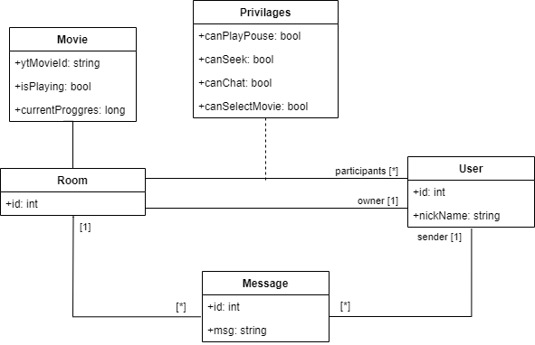

# Opis projektu

Platforma ma ma służyć użytkownikom do synchronizowanego oglądania filmików na youtube. Dodatkowo będzie ona pozwalać na komunikację tekstową z użytkownikami aplikacji.

Podobna aplikacja(https://w2g.tv/)

# Wymagania funkcjonalne

- [ ] Tworzenie pokoi
- [ ] Dołączenie do pokoi za pomocą linku
- [ ] Synchronizowane odtwarzanie/stopowanie filmu
- [ ] Synchronizowany wybór filmu
- [ ] Synchronizowane przewijanie filmu
- [ ] Możliwość dostosowania uprawnień dla członka pokoju
- [ ] Możliwość usunięcia członka pokoju

# Schemat UML

# Mockupy widoków

# Proponowany stack technologiczny

- Frontend
  - TypeScript
  - React
  - socket.io
  - MUI
- Backend
  - TypeScript
  - socket.io
  - Express
